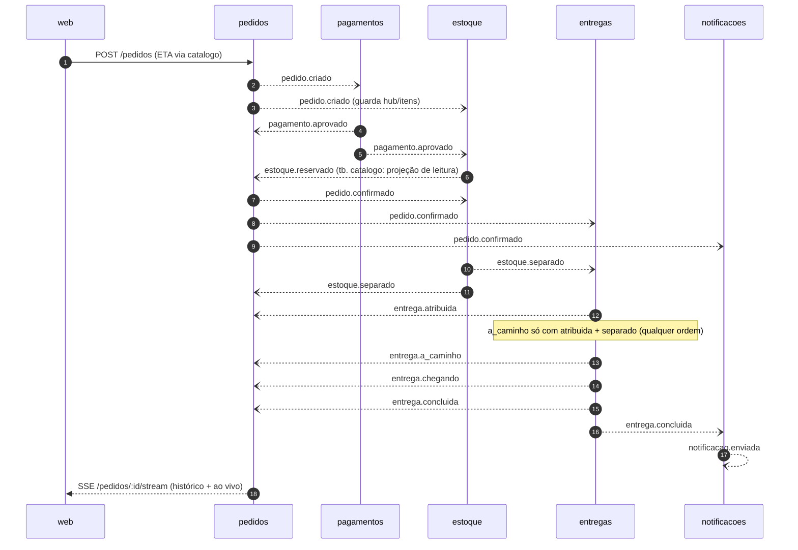

# Mapa de eventos do Já Já

Formato: `contexto.evento_no_passado` — sempre fato consumado, nunca comando.
Todo evento carrega `id` (uuid), `tipo`, `ocorridoEm` (ISO), `pedidoId`
quando houver, e payload tipado em `packages/contratos`.

> **Escopo atual:** caminho feliz completo, do pedido à entrega. Falhas e
> compensações (recusas, estornos, estoque insuficiente, atrasos) ficam para
> o prompt 6. Eventos **implementados** circulam no bus em memória via
> apps/runner. O serviço `pedidos`, além das transições da sua máquina de
> estados, consome quase todos os eventos do pedido para a projeção da linha
> do tempo (`eventos_pedido`, exposta em GET /pedidos/:id/eventos e via SSE).

## pedido
- `pedido.criado` — cliente fechou a sacola; pedido registrado.
  **Implementado.** Produtor: `pedidos` · Consumidores: `pagamentos`,
  `estoque` (guarda hub e itens para reservar depois), `pedidos` (projeção).
- `pedido.confirmado` — pagamento ok e estoque reservado.
  **Implementado.** Produtor: `pedidos` · Consumidores: `estoque` (separação),
  `entregas` (atribuição), `notificacoes`, `pedidos` (projeção) — **fan-out**:
  um evento, três serviços reagindo.
- `pedido.cancelado` — cancelado pelo cliente ou pelo sistema. (prompt 6)

## pagamento
- `pagamento.aprovado` — **Implementado.** Produtor: `pagamentos` (simula um
  PIX, aprova sempre por enquanto) · Consumidores: `pedidos` (status → "pago"),
  `estoque` (dispara a reserva).
- `pagamento.recusado` · `pagamento.estornado` (prompt 6)

## estoque
- `estoque.reservado` — itens do pedido reservados no hub.
  **Implementado.** Produtor: `estoque` · Consumidores: `pedidos` (status →
  "confirmado", publica `pedido.confirmado`), `catalogo` (projeção de leitura:
  atualiza sua cópia do estoque para o detalhe do produto).
  > Nota: a página de detalhe do produto exibe apenas uma **foto do estoque**
  > (consulta síncrona de leitura). A reserva de verdade acontece por este
  > evento, depois do pedido — o número da tela pode estar defasado.
- `estoque.insuficiente` — não havia quantidade para reservar. (prompt 6)
- `estoque.liberado` — reserva desfeita (cancelamento/recusa). (prompt 6)
- `estoque.separado` — itens separados, prontos para entrega.
  **Implementado.** Produtor: `estoque` · Consumidores: `entregas`
  (coordenação do a_caminho), `pedidos` (status → "separado").

## entrega
- `entrega.atribuida` — entregador aceitou o pedido.
  **Implementado.** Produtor: `entregas` · Consumidores: `pedidos` (só linha
  do tempo — na tela vira rodapé, não linha; ver docs/design.md).
- `entrega.a_caminho` — **Implementado.** Produtor: `entregas` · Consumidor:
  `pedidos`. Só é publicado quando `entrega.atribuida` **e** `estoque.separado`
  do mesmo pedido já chegaram, em qualquer ordem — coordenação por eventos com
  estado parcial no banco do `entregas`.
- `entrega.chegando` `{ distanciaMetros }` — **Implementado.** Produtor:
  `entregas` · Consumidor: `pedidos`.
- `entrega.concluida` `{ recebidoPor }` — **Implementado.** Produtor:
  `entregas` (libera o entregador) · Consumidores: `pedidos` (status →
  "entregue"), `notificacoes`.
- `entrega.atrasada` — passou do ETA prometido. (prompt 6)
- `entrega.sem_entregador` — ninguém disponível no hub. (prompt 6)

## notificacao
- `notificacao.enviada` — cliente avisado. **Implementado.** Produtor:
  `notificacoes` (registra no banco e no console; assina `pedido.confirmado`
  e `entrega.concluida`) · Consumidores: ninguém por enquanto.

## Caminho feliz (sequência)

